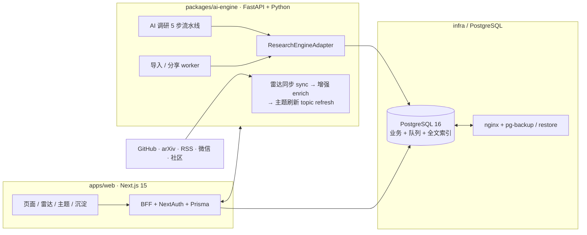

# AI技术调研平台

> AI 帮我们读文章、抓热搜、看趋势；我们给反馈、踩坑记下来，团队的判断和经验会越攒越多。
> 架构基线：[`docs/ARCHITECTURE.md`](./docs/ARCHITECTURE.md) v4.0

[](https://github.com/csbpku/deep_research/actions/workflows/ci.yml)

## 这个项目做什么

一个面向个人 / 小团队的技术调研与情报沉淀平台。AI 自动跟进 GitHub、arXiv、RSS、微信公众号和社区讨论等来源，把候选人文章用多维度评分排序、聚合；成员阅读、做标注、转发给同事，团队对这些内容的判断会被保留、检索、再利用。

**核心能力**

- **技术雷达**：从 GitHub、arXiv、RSS、微信公众号、Hacker News / Product Hunt / Reddit 等社区和用户分享持续发现候选；同步链路为 `sync → enrich → topic refresh`。每条候选附 LLM 轻量解读与多维内容评分（7 个维度每维 0–3 分，加权总分 0–100），归入深入阅读 / 略读 / 收藏等层级；GitHub 仓库候选按 Distilled 层级统一生成 Zread 项目文档，详情页提供「刷新文档」入口（强制重取，失败保留旧缓存）。
- **技术专题**：关注长期专题后自动聚合热点议题，生成带可点击引用的综述（tldr / keyChanges / subtopics / openQuestions）；发布调研自动回流专题，`/me/topics` 汇总未读议题与最近研究。
- **沉淀库**：长文与讨论精华共用同一结构，支持草稿 / 发布 / 全文搜索 / 修改审计。
- **文件导入**：上传 `.md / .txt / .html`，异步转成当前用户的私有 Markdown 草稿。
- **AI 调研**：对话澄清主题/背景/资料与产物类型，自动推断 objective 并给出 Research Brief 与可复用上下文；启动异步 5 步流水线（研究 → 草拟 → 注入来源 → 校核 → 入库），草稿必须实际修改过才能发布。
- **团队讨论 + Admin**：团队讨论常驻雷达正文下方，支持 @成员、回复通知和“我的通知”；成员可把高价值评论提议沉淀为知识卡片。Admin 对雷达做软屏蔽/恢复，而非逐条审批，并处理分享审核、评论提炼、同步状态和失败任务。
- **搜索与分享**：全文检索（PostgreSQL GIN / 触发器）+ 成员对外分享（URL 经 SSRF-safe 抓取 + LLM 摘要后入候选池）。
- **运行底线**：权限、成本埋点、结构化日志、`pg_dump` 备份恢复、Docker Compose 部署脚手架。

文档总入口见 [`docs/README.md`](./docs/README.md)；技术设计说明见 [`docs/ARCHITECTURE.md`](./docs/ARCHITECTURE.md)，按功能验收见 [`docs/FUNCTIONAL_CHECKLIST.md`](./docs/FUNCTIONAL_CHECKLIST.md)，部署见下文。

## 架构总览



- **`apps/web/`** —— 用户能看到的：登录、技术雷达、主题、沉淀详情 / 编辑、文件导入、管理员控制台。
- **`packages/ai-engine/`** —— 后台长任务：雷达同步 → 增强 → 主题刷新、AI 调研 5 步流水线、文件导入转换、分享提交、SSRF-safe URL fetch、Tavily retriever。
- **`packages/shared/`** —— TypeScript ↔ Python 镜像的 Zod schema、错误码、状态枚举；跨语言双方向只读，改动走独立 PR。
- **`infra/`** —— `docker-compose.yml` + nginx + 多阶段 Dockerfile + `pg-backup.sh` / `pg-restore.sh` / `import-tmp-cleanup.sh`。

更多见 [`docs/ARCHITECTURE.md`](./docs/ARCHITECTURE.md)。

## 技术栈

### 本地开发服务常驻（macOS）

如果希望关闭终端后仍保持本地 Web 和 AI engine 运行，可安装仓库中的 launchd 模板：

```bash
# 先完成依赖、环境文件、数据库 migration，并生成 production build
./scripts/setup.sh --quick
pnpm --filter @deep-research/web build

mkdir -p ~/Library/LaunchAgents
cp infra/launchd/com.deep-research.web.plist ~/Library/LaunchAgents/
cp infra/launchd/com.deep-research.ai.plist ~/Library/LaunchAgents/
launchctl bootstrap gui/$(id -u) ~/Library/LaunchAgents/com.deep-research.web.plist
launchctl bootstrap gui/$(id -u) ~/Library/LaunchAgents/com.deep-research.ai.plist
```

模板中的 `WorkingDirectory` 和 Node/uv 路径是本机模板值；如果仓库目录、Homebrew 路径或 Python 虚拟环境不同，先修改 plist。launchd Web 使用 `next start`，代码变更后需要重新执行 `pnpm --filter @deep-research/web build`，再重启 Web job。

停止托管服务：

```bash
launchctl bootout gui/$(id -u)/com.deep-research.web
launchctl bootout gui/$(id -u)/com.deep-research.ai
```

launchd 托管的 AI engine 使用稳定模式（不随代码文件自动重启）；需要开发热重载时再单独运行 `pnpm dev:ai`。日志位于 `/tmp/deep-research-web*.log` 和 `/tmp/deep-research-ai*.log`。

| 层 | 选型 |
|---|---|
| Frontend / BFF | Next.js 15（App Router）、React 19、TypeScript、Vitest、Playwright、NextAuth、Prisma |
| AI / 后台 | Python 3.11、FastAPI、Pydantic、psycopg、`gpt-researcher` 主适配（`fake` 作 fallback）、Tavily retriever、uv |
| 数据库 | PostgreSQL 16 + `pg_trgm` 模糊检索，`tsvector` 全文索引；migration 由 Prisma 管理 |
| 部署 | Docker Compose + nginx 1.27（HTTP-only，TLS 模板待签发），本地/单 VPS |
| 工具链 | pnpm workspace（10+）、uv、ruff + mypy、tsc、GitHub Actions CI |

外部依赖：Anthropic / OpenAI（按 adapter）、Tavily；登录支持邮箱密码，Google OAuth 可选。

## 本地部署

### 前置条件

- 原生模式：Node.js ≥ 20.11、pnpm ≥ 10、Python ≥ 3.11、uv、PostgreSQL 16。
- Docker 模式：Docker Engine 24+ 与 Compose v2；建议至少 2 vCPU / 4 GB RAM。
- 真实 AI：一个受支持 provider 的 API key，以及 Tavily key（或将 `RETRIEVER=duckduckgo`）。只验 UI 可用 `AI_ENGINE_ADAPTER=fake`。
- 邮箱密码登录：将 `ALLOWED_EMAIL_DOMAINS` 配置为允许激活/登录的邮箱域，并通过 `AUTH_INVITE_CODE` 控制首次激活；公开注册已关闭，生产环境必须使用 HTTPS。
- Google OAuth（可选）：创建 Web application，并登记 `http://localhost:3000/api/auth/callback/google`。

### 原生启动

```bash
# 1. 克隆仓库
git clone https://github.com/csbpku/deep_research.git
cd deep_research

# 2. 检测环境、安装依赖、生成 env、建库并执行 migration
./scripts/setup.sh

# 不配 AI key / Google OAuth，只验证产品 UI 与流程（可用邀请码激活邮箱密码登录）
./scripts/setup.sh --quick

# 3. 起服务（两个终端）
pnpm dev:web     # → http://localhost:3000
pnpm dev:ai      # → http://localhost:4000
```

安装脚本会在 migration 后自动补齐默认雷达信息源：共 22 个稳定 source 定义，其中一部分默认停用以避免重复或低质量抓取。信息源配置保存在 `radar_sources` 数据表，不依赖 API key；GitHub token、Product Hunt token 只用于增强对应源。这个初始化是幂等的，只创建缺失行，不会覆盖 Admin 在控制台修改过的 `enabled/config`。

容器启动时 Web entrypoint 也会执行同一个默认源 bootstrap，因此 `git clone` + `./scripts/setup.sh`、本地 Docker 和 GHCR/VPS 部署使用同一套初始化逻辑。

首次安装后：

1. 初始管理员默认是 `shaobo.chen@shopee.com`，setup 会把它创建或提升为 Admin。
2. 登录页选择“邀请码激活”，输入该邮箱和 `.env` 中的 `AUTH_INVITE_CODE`，设置一次密码。
3. 之后使用邮箱密码登录，管理后台地址为 `/admin`。邀请码不会打印到日志。

首次启动或切换分支后，可显式复核数据库与服务：

```bash
pnpm db:deploy
pnpm db:generate
curl -fsS http://localhost:3000/api/healthz
curl -fsS http://localhost:4000/healthz
```

使用邮箱密码登录时，先确认 `ALLOWED_EMAIL_DOMAINS` 包含邮箱域名，并在登录页的“邀请码激活”中输入 `AUTH_INVITE_CODE` 设置密码；激活后即可正常登录，公开注册接口会固定拒绝。`--quick` 生成的配置不会注册 Google provider，但邮箱密码登录仍可用。`BOOTSTRAP_ADMIN_EMAIL` 默认是 `shaobo.chen@shopee.com`，首次启动会幂等创建/提升该 Admin；如果该账号尚未设置密码，可用同一邮箱和邀请码完成一次激活。

未配置 Google OAuth 时，仍可免登录浏览首页、雷达、调研库和主题等界面；提交 AI 调研、评论、关注/收藏、我的内容和管理后台等操作需要登录。`--quick` 使用 fake adapter，AI 调研返回 mock 数据，不产生 API 费用。

选择真实 LLM 时，setup 默认提供 MiniMax 主模型 + DeepSeek fallback 的直连模式；两者使用独立的 API key 和 Base URL。也可以选择本地兼容 proxy：Anthropic-compatible（例如 cc-switch，默认本机端口 `15721`）或 OpenAI-compatible（例如 ais-switch / vibeproxy）。运行时只认三层 canonical 路由：`RESEARCH_LLM`、`UTILITY_LLM`、`FALLBACK_LLM`；旧的 `SMART_LLM` / `FAST_LLM` / `STRATEGIC_LLM` / `BRIEF_LLM` 仅作为 gpt-researcher 兼容镜像。直连模式使用 `MINIMAX_*` / `DEEPSEEK_*` profile，旧的 `ANTHROPIC_*` / `OPENAI_*` 变量继续用于 proxy 和兼容配置。

### 本地 Docker

```bash
cp .env.example .env
# 至少替换 POSTGRES_PASSWORD、NEXTAUTH_SECRET、INTERNAL_SERVICE_TOKEN，
# 并填写 ALLOWED_EMAIL_DOMAINS 和所选 AI provider 凭证；Google OAuth 可选。
docker compose --env-file .env -f infra/docker-compose.yml config --quiet
docker compose --env-file .env -f infra/docker-compose.yml up -d --build
curl -fsS http://localhost:3000/api/healthz      # web
curl -fsS http://localhost:4000/healthz          # ai-engine
docker compose --env-file .env -f infra/docker-compose.yml ps
```

容器启动时 Web entrypoint 自动执行 `prisma migrate deploy`、Admin bootstrap 和默认雷达信息源 bootstrap。PostgreSQL 只绑定 `127.0.0.1:5432`；生产环境不要改成公网监听。完整环境变量清单见 [`.env.example`](./.env.example)。

### 验证

```bash
pnpm typecheck
pnpm test                      # vitest 单测
pnpm --filter @deep-research/web exec playwright test --project=chromium   # E2E
cd packages/ai-engine && uv run pytest -q && uv run ruff check . && uv run mypy ai_engine tools
```

## 单 VPS 生产部署

推荐 Ubuntu 24.04 LTS、2 vCPU / 4 GB RAM 起步、独立域名和非 root 运维账号。以下是当前仓库已支持的单机拓扑；高可用、多机数据库和集中监控不在当前范围。

1. DNS：将域名的 `A/AAAA` 记录指向 VPS；先等待解析生效。
2. 主机：安装 Docker Engine/Compose，克隆到 `/opt/deep_research`，只允许 SSH、80、443 入站；不要放行 3000、4000、5432。
3. Secrets：复制 `.env.example` 为 `.env`，权限设为 `600`；用 `openssl rand -hex 32` 分别生成数据库、NextAuth 和内部服务令牌。设置 `NEXTAUTH_URL=https://research.example.com`。如启用 Google OAuth，再登记 `https://research.example.com/api/auth/callback/google`。
4. 配置：填写 `ALLOWED_EMAIL_DOMAINS`、`AUTH_INVITE_CODE`、`BOOTSTRAP_ADMIN_EMAIL`、AI provider 与检索凭证。默认管理员邮箱必须属于 `ALLOWED_EMAIL_DOMAINS`。`.env` 不提交 Git，不写入镜像。邮箱密码账号在登录页通过邀请码激活。
5. TLS：用 Certbot/acme.sh 签发 `fullchain.pem` 与 `privkey.pem`，放入 `infra/certs/`（私钥 `0600`）；将 Compose 的 nginx mount 从 `infra/nginx.conf` 切换为 `infra/nginx-tls.conf`。证书签发前不要公开登录流量。
6. 启动：先校验配置，再构建启动；检查容器、HTTPS 和两项 health endpoint。

```bash
cd /opt/deep_research
cp .env.example .env
chmod 600 .env
docker compose --env-file .env -f infra/docker-compose.yml config --quiet
docker compose --env-file .env -f infra/docker-compose.yml up -d --build
docker compose --env-file .env -f infra/docker-compose.yml ps
curl -fsS https://research.example.com/healthz
curl -fsS https://research.example.com/ai-healthz
```

部署后必须实际登录一次，确认 Admin 仪表板、雷达同步、文件导入和 AI 调研可用。日志用 `docker compose ... logs --since=30m web ai-engine nginx` 查看。

#### GitHub Actions + GHCR 快速部署

仓库提供 `.github/workflows/deploy.yml`。它在 `CI` 成功后自动构建 Web、AI engine 两个 Linux/amd64 核心镜像，推送带 commit SHA 的不可变 GHCR 标签，再通过 SSH 让 VPS 拉取并启动；VPS 上的 `.env`、数据库卷、证书和日志不会被覆盖。真实浏览器 `render-review` 改为按需启用的 Compose profile，不进入默认发布链路。失败时工作流会尝试恢复上一次记录的镜像 SHA。

首次启用需要在 GitHub `Settings → Environments → production` 配置：

- Secrets：`VPS_HOST`、`VPS_USER`、`VPS_SSH_KEY`、`VPS_KNOWN_HOSTS`
- 如果 GHCR 包保持私有，再加 `GHCR_USERNAME`、`GHCR_READ_TOKEN`
- Variable：`VPS_DEPLOY_PATH`，不填时默认 `/opt/deep_research`

部署用户需要能运行 Docker。建议使用专用非 root 用户和仅用于部署的 SSH key；`VPS_KNOWN_HOSTS` 应保存固定的 SSH 主机指纹，工作流不会关闭 host key 校验。`120.76.248.204` 可以作为 `VPS_HOST`，不需要域名才能完成镜像部署。

之后只要把代码推送到 `main`，CI 通过就会自动部署。也可以在 Actions 页面手动运行 `Deploy`。镜像回滚不回滚数据库 schema，新增迁移必须保持向前兼容。

备份、升级和回滚：每天运行 `infra/pg-backup.sh` 并把备份复制到异机/对象存储；定期在隔离库执行 `infra/pg-restore.sh`。升级前先备份；如果需要数据库恢复，使用 `infra/pg-restore.sh`，不要把镜像回滚当成数据库回滚。

## 仓库布局

| 路径 | 作用 |
|---|---|
| `apps/web/` | Next.js 15 Web + BFF + Prisma + Vitest / Playwright |
| `packages/ai-engine/` | FastAPI + `gpt-researcher` 适配 + radar / import worker + SSRF-safe fetch |
| `packages/shared/` | 跨 runtime 的 Zod schema、错误码、状态枚举（双方只读） |
| `infra/` | `docker-compose.yml`、nginx、Dockerfile、`pg-backup.sh`、`pg-restore.sh` |
| `docs/` | 本地开发知识层；从 [`docs/README.md`](./docs/README.md) 进入，当前规范与历史归档分层维护 |
| `scripts/` | 仓库根 helper：`setup.sh`、`cost_extrapolation.py`、`test-local-env.sh` |

## 当前状态

技术方案、数据模型、安全边界与部署拓扑见 [`docs/ARCHITECTURE.md`](./docs/ARCHITECTURE.md)；最新进度、测试基线与 follow-up 见 [`docs/PROJECT_STATUS.md`](./docs/PROJECT_STATUS.md)（本地知识层）。本 README 只维护现状，不记录演进过程。

## 贡献

这是一个个人项目仓库，目前不接受外部 PR。新克隆按 `scripts/setup.sh` 即可起，按 [`docs/ARCHITECTURE.md`](./docs/ARCHITECTURE.md) 约定的架构与数据模型工作。

## License

UNLICENSED. Personal project.
