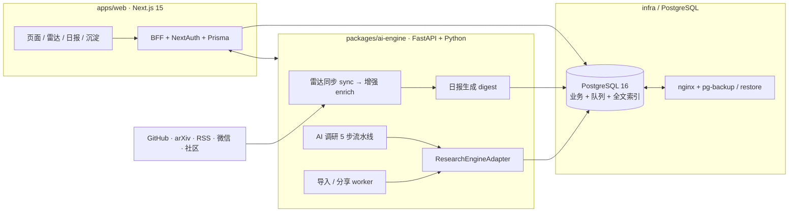

# AI技术调研平台

> AI 帮我们读文章、抓热搜、看趋势；我们给反馈、踩坑记下来，团队的判断和经验会越攒越多。
> 架构基线：[`docs/ARCHITECTURE.md`](./docs/ARCHITECTURE.md) v3.6

[](https://github.com/csbpku/deep_research/actions/workflows/ci.yml)

## 这个项目做什么

一个面向个人 / 小团队的技术调研与情报沉淀平台。AI 自动跟进 GitHub、arXiv、RSS、微信公众号和社区讨论等来源，把候选人文章用多维度评分排序、聚合；成员阅读、做标注、转发给同事，团队对这些内容的判断会被保留、检索、再利用。

**核心能力**

- **技术雷达**：从 GitHub、arXiv、RSS、微信公众号、Hacker News / Product Hunt / Reddit 等社区和用户分享持续发现候选，每条附 LLM 轻量解读与多维内容评分：7 个维度（受众匹配、信息增量、分析深度、可行动性等）每维 0–3 分，加权总分 0–100，并归入深入阅读 / 略读 / 收藏等层级。
- **AI 雷达日报**：每天自动聚合当日高信号雷达候选，由 LLM 生成一篇跨来源总结文章（含 TL;DR、分节叙事、重点与来源排名），作为一条 `digest://YYYY-MM-DD` 的发布摘要。
- **沉淀库**：长文与讨论精华共用同一结构，支持草稿 / 发布 / 全文搜索 / 修改审计。
- **文件导入**：上传 `.md / .txt / .html`，异步转成当前用户的私有 Markdown 草稿。
- **AI 调研**：给一个主题，启动异步 5 步流水线（研究 → 草拟 → 注入来源 → 校核 → 入库），用户必须实际修改过才能发布。
- **基础评论 + Admin**：雷达、日报和沉淀都能评论；Admin 控制台统一处理雷达 promote、分享审核、评论提名、同步状态和失败任务。
- **搜索与分享**：全文检索（PostgreSQL GIN / 触发器）+ 成员对外分享（URL 经 SSRF-safe 抓取 + LLM 摘要后入候选池）。
- **运行底线**：权限、成本埋点、结构化日志、`pg_dump` 备份恢复、Docker Compose 部署脚手架。

技术设计说明见 [`docs/ARCHITECTURE.md`](./docs/ARCHITECTURE.md)，部署见下文。

## 架构总览



- **`apps/web/`** —— 用户能看到的：登录、雷达列表、AI 雷达日报、沉淀详情 / 编辑、文件导入、管理员控制台。
- **`packages/ai-engine/`** —— 后台长任务：雷达同步 → 增强 → 日报、调研 5 步流水线、文件导入转换、分享提交、SSRF-safe URL fetch、Tavily retriever。
- **`packages/shared/`** —— TypeScript ↔ Python 镜像的 Zod schema、错误码、状态枚举；跨语言双方向只读，改动走独立 PR。
- **`infra/`** —— `docker-compose.yml` + nginx + 多阶段 Dockerfile + `pg-backup.sh` / `pg-restore.sh` / `import-tmp-cleanup.sh`。

更多见 [`docs/ARCHITECTURE.md`](./docs/ARCHITECTURE.md)。

## 技术栈

### 本地开发服务常驻（macOS）

如果希望关闭终端后仍保持本地 Web 和 AI engine 运行，可安装仓库中的 launchd 模板：

```bash
mkdir -p ~/Library/LaunchAgents
cp infra/launchd/com.deep-research.web.plist ~/Library/LaunchAgents/
cp infra/launchd/com.deep-research.ai.plist ~/Library/LaunchAgents/
launchctl bootstrap gui/$(id -u) ~/Library/LaunchAgents/com.deep-research.web.plist
launchctl bootstrap gui/$(id -u) ~/Library/LaunchAgents/com.deep-research.ai.plist
```

停止托管服务：

```bash
launchctl bootout gui/$(id -u)/com.deep-research.web
launchctl bootout gui/$(id -u)/com.deep-research.ai
```

日志位于 `/tmp/deep-research-web*.log` 和 `/tmp/deep-research-ai*.log`。

| 层 | 选型 |
|---|---|
| Frontend / BFF | Next.js 15（App Router）、React 19、TypeScript、Vitest、Playwright、NextAuth、Prisma |
| AI / 后台 | Python 3.11、FastAPI、Pydantic、psycopg、`gpt-researcher` 主适配（`fake` 作 fallback）、Tavily retriever、uv |
| 数据库 | PostgreSQL 16 + `pg_trgm` 模糊检索，`tsvector` 全文索引；migration 由 Prisma 管理 |
| 部署 | Docker Compose + nginx 1.27（HTTP-only，TLS 模板待签发），本地/单 VPS |
| 工具链 | pnpm workspace（10+）、uv、ruff + mypy、tsc、GitHub Actions CI |

外部依赖：Anthropic / OpenAI（按 adapter）、Tavily、Google OAuth。

## 本地部署

### 前置条件

- 原生模式：Node.js ≥ 20.11、pnpm ≥ 10、Python ≥ 3.11、uv、PostgreSQL 16。
- Docker 模式：Docker Engine 24+ 与 Compose v2；建议至少 2 vCPU / 4 GB RAM。
- 真实 AI：一个受支持 provider 的 API key，以及 Tavily key（或将 `RETRIEVER=duckduckgo`）。只验 UI 可用 `AI_ENGINE_ADAPTER=fake`。
- Google OAuth：创建 Web application，并登记 `http://localhost:3000/api/auth/callback/google`。

### 原生启动

```bash
# 1. 克隆仓库
git clone https://github.com/csbpku/deep_research.git
cd deep_research

# 2. 检测环境、安装依赖、生成 env、建库并执行 migration
./scripts/setup.sh

# 不配 AI key，只验证产品 UI 与流程
./scripts/setup.sh --quick

# 3. 起服务（两个终端）
pnpm dev:web     # → http://localhost:3000
pnpm dev:ai      # → http://localhost:4000
```

首次登录前，在 Google OAuth 控制台登记回调 URL，确认 `ALLOWED_EMAIL_DOMAINS` 包含登录邮箱域名。`BOOTSTRAP_ADMIN_EMAIL` 可在首次启动时幂等创建/提升初始 Admin；也可稍后由已有 Admin 在成员管理中调整角色。

### 本地 Docker

```bash
cp .env.example .env
# 至少替换 POSTGRES_PASSWORD、NEXTAUTH_SECRET、INTERNAL_SERVICE_TOKEN，
# 并填写 ALLOWED_EMAIL_DOMAINS、Google OAuth 和所选 AI provider 凭证。
docker compose --env-file .env -f infra/docker-compose.yml config --quiet
docker compose --env-file .env -f infra/docker-compose.yml up -d --build
curl -fsS http://localhost:3000/api/healthz      # web
curl -fsS http://localhost:4000/healthz          # ai-engine
docker compose --env-file .env -f infra/docker-compose.yml ps
```

容器启动时 Web entrypoint 自动执行 `prisma migrate deploy` 和可选的 Admin bootstrap。PostgreSQL 只绑定 `127.0.0.1:5432`；生产环境不要改成公网监听。完整环境变量清单见 [`.env.example`](./.env.example)。

### 验证

```bash
pnpm typecheck
pnpm test                      # vitest 单测
pnpm --filter @deep-research/web exec playwright test --project=chromium   # E2E
cd packages/ai-engine && uv run pytest -q && uv run ruff check . && uv run mypy ai_engine tools
```

## 单 VPS 生产部署

推荐 Ubuntu 24.04 LTS、2 vCPU / 4 GB RAM 起步、独立域名和非 root 运维账号。以下是当前仓库已支持的单机拓扑；高可用、多机数据库和集中监控不在当前范围。

1. DNS：将域名的 `A/AAAA` 记录指向 VPS；先等待解析生效。
2. 主机：安装 Docker Engine/Compose，克隆到 `/opt/deep_research`，只允许 SSH、80、443 入站；不要放行 3000、4000、5432。
3. Secrets：复制 `.env.example` 为 `.env`，权限设为 `600`；用 `openssl rand -hex 32` 分别生成数据库、NextAuth 和内部服务令牌。设置 `NEXTAUTH_URL=https://research.example.com`，并把 Google OAuth 回调登记为 `https://research.example.com/api/auth/callback/google`。
4. 配置：填写 `ALLOWED_EMAIL_DOMAINS`、`BOOTSTRAP_ADMIN_EMAIL`、AI provider 与检索凭证。`.env` 不提交 Git，不写入镜像。
5. TLS：用 Certbot/acme.sh 签发 `fullchain.pem` 与 `privkey.pem`，放入 `infra/certs/`（私钥 `0600`）；将 Compose 的 nginx mount 从 `infra/nginx.conf` 切换为 `infra/nginx-tls.conf`。证书签发前不要公开登录流量。
6. 启动：先校验配置，再构建启动；检查容器、HTTPS 和两项 health endpoint。

```bash
cd /opt/deep_research
cp .env.example .env
chmod 600 .env
docker compose --env-file .env -f infra/docker-compose.yml config --quiet
docker compose --env-file .env -f infra/docker-compose.yml up -d --build
docker compose --env-file .env -f infra/docker-compose.yml ps
curl -fsS https://research.example.com/healthz
curl -fsS https://research.example.com/ai-healthz
```

部署后必须实际登录一次，确认 Admin 仪表板、雷达同步、文件导入和 AI 调研可用。日志用 `docker compose ... logs --since=30m web ai-engine nginx` 查看。

备份、升级和回滚：每天运行 `infra/pg-backup.sh` 并把备份复制到异机/对象存储；定期在隔离库执行 `infra/pg-restore.sh`。升级前先备份并记录当前 Git SHA/镜像，`git pull` 后重建；若健康检查或 smoke 失败，切回原 SHA/镜像并恢复兼容备份。

## 仓库布局

| 路径 | 作用 |
|---|---|
| `apps/web/` | Next.js 15 Web + BFF + Prisma + Vitest / Playwright |
| `packages/ai-engine/` | FastAPI + `gpt-researcher` 适配 + radar / import worker + SSRF-safe fetch |
| `packages/shared/` | 跨 runtime 的 Zod schema、错误码、状态枚举（双方只读） |
| `infra/` | `docker-compose.yml`、nginx、Dockerfile、`pg-backup.sh`、`pg-restore.sh` |
| `docs/` | 公开技术文档：`ARCHITECTURE.md`（见下） |
| `scripts/` | 仓库根 helper：`setup.sh`、`cost_extrapolation.py`、`test-local-env.sh` |

## 当前状态

技术方案、数据模型、安全边界与部署拓扑见 [`docs/ARCHITECTURE.md`](./docs/ARCHITECTURE.md)。

## 贡献

这是一个个人项目仓库，目前不接受外部 PR。新克隆按 `scripts/setup.sh` 即可起，按 [`docs/ARCHITECTURE.md`](./docs/ARCHITECTURE.md) 约定的架构与数据模型工作。

## License

UNLICENSED. Personal project.
